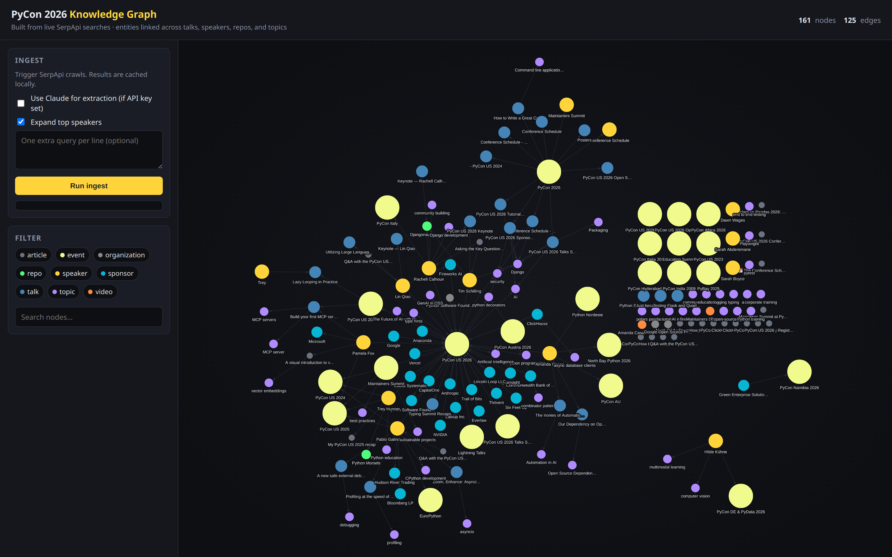

<div align="center">

# PyCon 2026 Knowledge Graph

**An interactive, force-directed graph of PyCon US 2026 — assembled live from SerpApi search results.**

<sub>Built for the SerpApi raffle · Long Beach · May 13–19, 2026</sub>

[Quick Start](#quick-start) · [How It Works](#how-it-works) · [Architecture](#architecture) · [API](#api)

<br />



</div>

---

## What is this?

`pycon-slerp` runs live Google and Google News queries through [SerpApi](https://serpapi.com), pulls structured entities out of the results — speakers, talks, repos, topics, sponsors, papers — and renders the relationships as a force-directed graph in the browser.

Every node carries its provenance: click it and you can see exactly which search results created it.

## Quick Start

```bash
git clone git@github.com:struktured/pycon-slerp.git
cd pycon-slerp

python3 -m venv .venv
.venv/bin/pip install -r requirements.txt

export SERPAPI_API_KEY=...      # required
export ANTHROPIC_API_KEY=...    # optional — enables Claude entity extraction

.venv/bin/uvicorn app.main:app --port 8765
```

Open <http://127.0.0.1:8765>, click **Run ingest** in the sidebar, and watch the graph populate. Tick **Use Claude** for richer entity extraction.

## How It Works

```
            ┌─────────────┐
            │   SerpApi   │   live Google + Google News
            └──────┬──────┘
                   ▼
            ┌─────────────┐
            │ search cache│   SQLite — re-runs are free
            └──────┬──────┘
                   ▼
        ┌──────────┴───────────┐
        │  Entity Extraction   │   heuristic (always)
        │                      │   + Claude (optional)
        └──────────┬───────────┘
                   ▼
            ┌─────────────┐
            │ nodes/edges │   SQLite
            └──────┬──────┘
                   ▼
            ┌─────────────┐
            │   FastAPI   │   /api/graph, /api/node/{id}
            └──────┬──────┘
                   ▼
            ┌─────────────┐
            │ cytoscape.js│   force-directed (fcose)
            └─────────────┘
```

1. **Seed** — six hand-picked queries cover the conference surface area: schedule, speakers, sponsors, tutorials, news.
2. **Extract** — two parallel paths produce entities of nine types:
    - *Heuristic*: URL pattern matching (`github.com/<user>/<repo>` → repo, `arxiv.org/abs/...` → paper) plus a curated topic keyword list. Always on.
    - *Claude*: structured-output extraction from search snippets via `claude-haiku-4-5`. Activates when `ANTHROPIC_API_KEY` is present.
3. **Expand** — the top speakers (by edge degree) get follow-up searches to surface their repos, prior talks, papers.
4. **Render** — FastAPI serves the graph as JSON; the browser draws it with [cytoscape.js](https://js.cytoscape.org/) + the [fcose](https://github.com/iVis-at-Bilkent/cytoscape.js-fcose) layout. Click nodes for sources, filter by type, hover to highlight neighborhoods.

## Node Types

| Type | Color | Source |
| --- | --- | --- |
| `speaker` | yellow | name patterns + GitHub user paths + Claude |
| `talk` | blue | pycon.org talk pages + Claude |
| `topic` | purple | keyword list + Claude |
| `repo` | green | `github.com/<user>/<repo>` |
| `paper` | pink | `arxiv.org/abs/...` |
| `video` | orange | YouTube watch URLs |
| `sponsor` | cyan | Claude (from sponsor pages) |
| `event` | pale yellow | PyCon 2026 anchor + sub-events |
| `article` | grey | fallback for everything else |

## API

| Method | Path | Purpose |
| --- | --- | --- |
| `GET` | `/api/graph` | Full graph as `{ nodes, edges }` |
| `GET` | `/api/node/{id}` | Node detail with sources + neighbors |
| `GET` | `/api/stats` | Node/edge counts, breakdown by type |
| `POST` | `/api/ingest` | Trigger a SerpApi crawl |
| `GET` | `/api/health` | Reports API-key presence |

`POST /api/ingest` body:

```json
{
  "extra_queries": ["pycon 2026 lightning talks"],
  "use_claude": true,
  "expand_speakers": true,
  "max_speakers_to_expand": 10
}
```

## Architecture

```
app/
├── db.py                SQLite schema + helpers
├── serpapi_client.py    Async SerpApi wrapper with disk cache
├── entity_extractor.py  Heuristic + Claude entity extraction
├── graph_builder.py     Seed + expand orchestration
└── main.py              FastAPI app

static/
├── index.html           Graph UI
├── graph.js             Cytoscape config + side panel
└── styles.css           Dark theme

scripts/
└── screenshot.py        Headless Playwright screenshot

data/                    SQLite + SerpApi response cache (gitignored)
```

## Tech Stack

| Layer | Choice |
| --- | --- |
| Backend | Python 3.13 · FastAPI · httpx · SQLite |
| Frontend | Vanilla JS · cytoscape.js · fcose layout |
| Search | SerpApi (Google + Google News engines) |
| LLM | Anthropic Claude Haiku 4.5 (optional) |

## Reproducing the Screenshot

The hero image is generated headlessly with Playwright:

```bash
.venv/bin/pip install playwright
.venv/bin/playwright install chromium
.venv/bin/python scripts/screenshot.py
```

The script waits for the graph to have rendered and the fcose layout to settle, then captures a 1600×1000 PNG at 2x device pixel ratio.

## Credits

- [SerpApi](https://serpapi.com) — the search backbone
- [cytoscape.js](https://js.cytoscape.org/) + [fcose](https://github.com/iVis-at-Bilkent/cytoscape.js-fcose) — graph rendering
- [Anthropic Claude](https://www.anthropic.com/) — entity extraction
- [FastAPI](https://fastapi.tiangolo.com/) — the web framework

<sub>Submission to the SerpApi raffle at PyCon US 2026.</sub>
